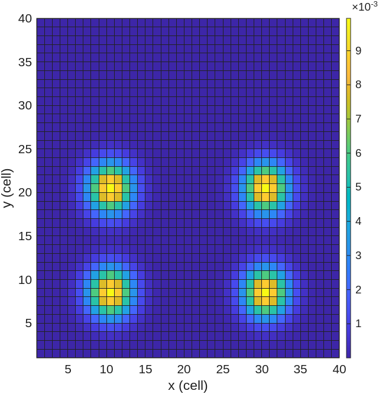
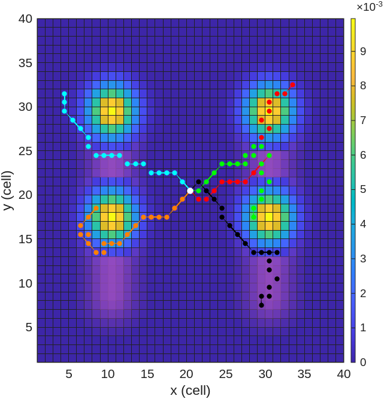

# Minimum Time Search of a Lost Target Using Multimodal Particle Swarm Optimization with Multiple Unmanned Aerial Vehicles

This repository presents the following article in MATLAB:

Thu Hang Khuat, Hai Trung Le, Khanh Thanh Tran, Thuy Pham, Manh Duong Phung,  "**Minimum Time Search of a Lost Target Using Multimodal Particle Swarm Optimization with Multiple Unmanned Aerial Vehicles**", PrePrint, 2026

## Installation
```
git@github.com:thuhangkhuat/EMPSO_target_search.git
```

## Run simulation
To run our method:
1. Download all the source files from this repository.
2. Open MATLAB.
3. Execute the main script by running `EMPSO.m`.

## Visualization

Below are visualizations of the method:

|  |  |
|:---:|:---:|

## Citation
```
@ARTICLE{EMPSO2026,
  author={Thu Hang Khuat, Hai Trung Le, Khanh Thanh Tran, Thuy Pham and Manh Duong Phung},
  journal={PrePrint}, 
  title={Minimum Time Search of a Lost Target Using Multimodal Particle Swarm Optimization with Multiple Unmanned Aerial Vehicles}, 
  year={2026},
  volume={},
  issue={},
  pages={},
  keywords={},
  doi={}}
``` 